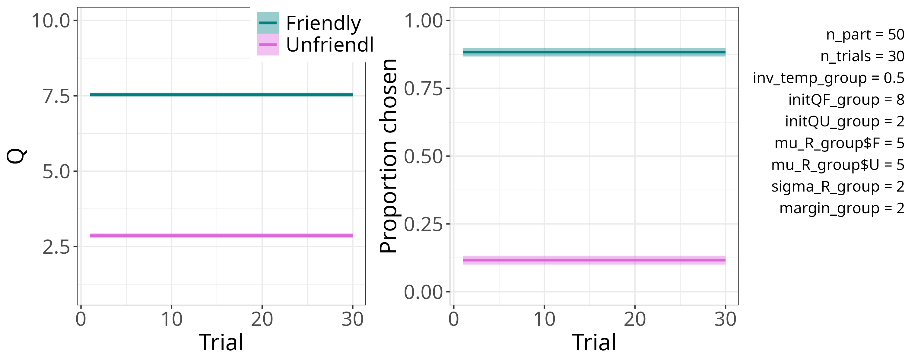
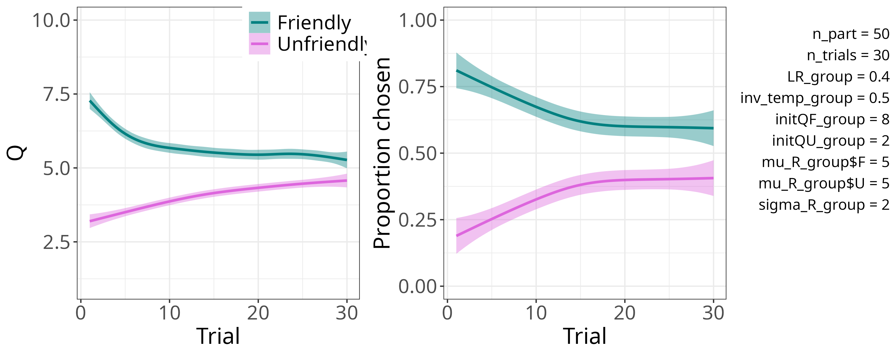
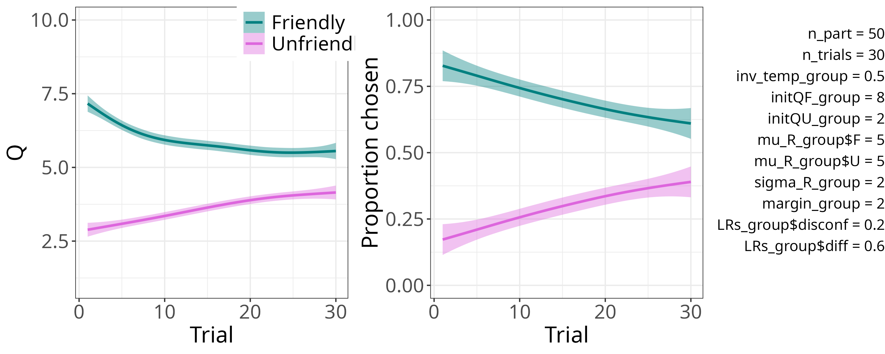
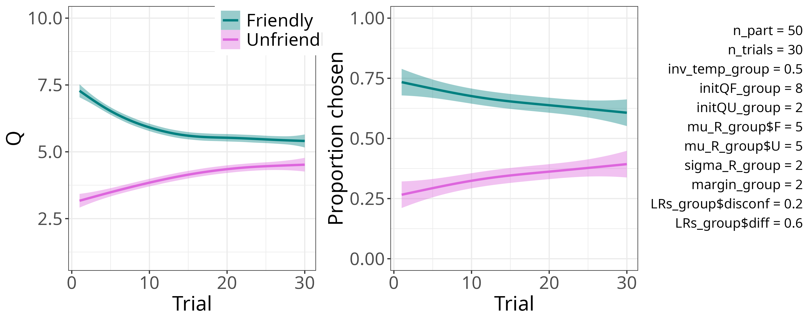
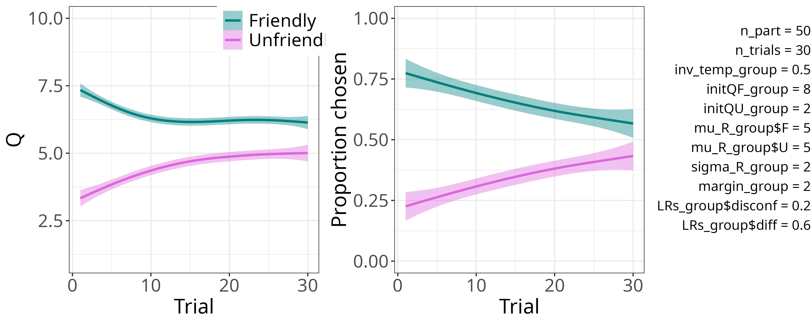
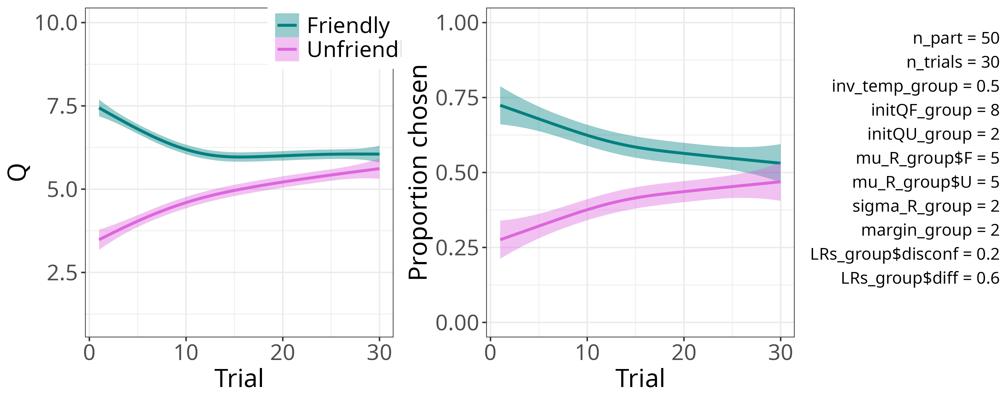

> In this document I inspect parameter recovery results. More specifically, I first look at the results of a single run of the simulation and fitting (where parameter settings are chosen by me), and then at many runs (where parameter settings are generated randomly).

```{r doc-setup, include = FALSE}
knitr::opts_chunk$set(echo = TRUE)
knitr::opts_chunk$set(message = FALSE)
knitr::opts_chunk$set(fig.width = 10, fig.height = 8)
```

```{r r-setup}
rm(list = ls())
main_dir <- "~/research/climate-RL-mod/"
util_dir <- paste0(main_dir, "9_utilities/")
mod_dir <- paste0(main_dir, "0_models/")
recov_dir <- paste0(main_dir, "3_param_recovery/")

sim_utils <- new.env()
source(paste0(util_dir, "sim_utils.R"), local = sim_utils)
plot <- new.env()
source(paste0(util_dir, "plot_utils.R"), local = plot)
fitting <- new.env()
source(paste0(util_dir, "fit_utils.R"), local = fitting)
util <- new.env()
source(paste0(util_dir, "utils.R"), local = util)
```

# `0_nolearning`
## Simulation behavior


## Single run (chosen parameters)
```{r 0-single, fig.height = 4}
mod_name <- "0_nolearning"
dat_dir <- paste0(recov_dir, mod_name, "/1_run/")

param_settings <- rjson::fromJSON(file = paste0(dat_dir, "sim_param_settings_1.json"))
fit_path <- paste0(dat_dir, "draws.rds")

free_params <- c("inv_temp_group", "initQF_group", "initQU_group")

draws <- readRDS(fit_path) %>%
  rename(setNames(paste0("means[", seq_along(free_params), "]"),
                  free_params))

to_plot <- list("inv_temp_group", c("initQF_group", "initQU_group"))
plot$posterior_densities(draws, to_plot, param_settings)

to_inspect <- c("inv_temp_group", "initQF_group", "initQU_group")
util$print_posterior_table(draws, param_settings, to_inspect)
```

## Many runs (random parameters)
```{r 0-many}
n_runs <- 100

dat_dir <- paste0(recov_dir, mod_name, "/100_runs/")

sim_params <- data.frame(k = 1:n_runs)
fit_params <- data.frame(k = 1:n_runs)

for (k in 1:n_runs) {
  sim_file <- paste0(dat_dir, "param_settings_", sprintf("%03d", k), ".json")
  sim_dat <- rjson::fromJSON(file = sim_file)

  fit_file <- paste0(dat_dir, "draws_", sprintf("%03d", k), ".rds")
  fit_dat <- readRDS(fit_file) %>%
    rename(setNames(paste0("means[", seq_along(free_params), "]"),
                    free_params))

  for (p in free_params) {
    sim_params[[p]][k] <- sim_dat[[p]]
    fit_params[[p]][k] <- median(fit_dat[[p]])
  }
}

plot$many_runs_param_fit(sim_params, fit_params, free_params)
```

# `1_std`
## Simulation behavior


## Single run (chosen parameters)
```{r 1-single}
mod_name <- "1_std"
dat_dir <- paste0(recov_dir, mod_name, "/1_run/")

param_settings <- rjson::fromJSON(file = paste0(dat_dir, "sim_param_settings_1.json"))
fit_path <- paste0(dat_dir, "draws.rds")

free_params <- c("LR_group", "inv_temp_group", "initQF_group", "initQU_group")

draws <- readRDS(fit_path) %>%
  rename(setNames(paste0("means[", seq_along(free_params), "]"),
                  free_params))
to_plot <- list("LR_group", "inv_temp_group", c("initQF_group", "initQU_group"))
plot$posterior_densities(draws, to_plot, param_settings)

to_inspect <- c("LR_group", "inv_temp_group", "initQF_group", "initQU_group")
util$print_posterior_table(draws, param_settings, to_inspect)
```

## Many runs (random parameters)
```{r 1-many}
n_runs <- 100

dat_dir <- paste0(recov_dir, mod_name, "/100_runs/")

sim_params <- data.frame(k = 1:n_runs)
fit_params <- data.frame(k = 1:n_runs)

for (k in 1:n_runs) {
  sim_file <- paste0(dat_dir, "param_settings_", sprintf("%03d", k), ".json")
  sim_dat <- rjson::fromJSON(file = sim_file)

  fit_file <- paste0(dat_dir, "draws_", sprintf("%03d", k), ".rds")
  fit_dat <- readRDS(fit_file) %>%
    rename(setNames(paste0("means[", seq_along(free_params), "]"),
                    free_params))

  for (p in free_params) {
    sim_params[[p]][k] <- sim_dat[[p]]
    fit_params[[p]][k] <- median(fit_dat[[p]])
  }
}

plot$many_runs_param_fit(sim_params, fit_params, free_params)
```

# `2_LRN_discr_approx_stat`: simple
Here the `initQ`s are fixed: they are not estimated, but fed to the model as data.

## Simulation behavior


## Single run (chosen parameters)
```{r 2-simple-single, fig.height = 4}
mod_name <- "2_LRN_discr_approx_stat/simple"
dat_dir <- paste0(recov_dir, mod_name, "/1_run/")
param_settings <- rjson::fromJSON(file = paste0(dat_dir, "sim_param_settings_1.json"))

fit_path <- paste0(dat_dir, "draws.rds")

free_params <- c("LR_disconf_group", "LR_diff_group", "inv_temp_group")
draws <- readRDS(fit_path) %>%
  rename(setNames(paste0("means[", seq_along(free_params), "]"),
                  free_params))

to_plot <- list(c("LR_disconf_group", "LR_diff_group"), "inv_temp_group")
plot$posterior_densities(draws, to_plot, param_settings)

to_inspect <- c("LR_disconf_group", "LR_diff_group", "inv_temp_group")
util$print_posterior_table(draws, param_settings, to_inspect)
```

## Many runs (random parameters)
```{r 2-simple-many}
n_runs <- 100

dat_dir <- paste0(recov_dir, mod_name, "/100_runs/")

sim_params <- data.frame(k = 1:n_runs)
fit_params <- data.frame(k = 1:n_runs)

for (k in 1:n_runs) {
  sim_file <- paste0(dat_dir, "param_settings_", sprintf("%03d", k), ".json")
  sim_dat <- rjson::fromJSON(file = sim_file)
  if ("LRs_group" %in% names(sim_dat)) {
    sim_dat[["LR_disconf_group"]] <- sim_dat[["LRs_group"]][1]
    sim_dat[["LR_diff_group"]] <- sim_dat[["LRs_group"]][2]
  }

  fit_file <- paste0(dat_dir, "draws_", sprintf("%03d", k), ".rds")
  fit_dat <- readRDS(fit_file) %>%
    rename(setNames(paste0("means[", seq_along(free_params), "]"),
                    free_params))

  for (p in free_params) {
    sim_params[[p]][k] <- sim_dat[[p]]
    fit_params[[p]][k] <- median(fit_dat[[p]])
  }
}

plot$many_runs_param_fit(sim_params, fit_params, free_params)
```

# `2_LRN_discr_approx_stat`: regular
Here the `initQ`s *are* free parameters.

## Simulation behavior


## Single run (chosen parameters)
```{r 2-regular-single}
mod_name <- "2_LRN_discr_approx_stat/regular"
dat_dir <- paste0(recov_dir, mod_name, "/1_run/")
param_settings <- rjson::fromJSON(file = paste0(dat_dir, "sim_param_settings_1.json"))

fit_path <- paste0(dat_dir, "draws.rds")

free_params <- c("LR_disconf_group", "LR_diff_group", "inv_temp_group", "initQF_group", "initQU_group")
draws <- readRDS(fit_path) %>%
  rename(setNames(paste0("means[", seq_along(free_params), "]"),
                  free_params))

to_plot <- list(c("LR_disconf_group", "LR_diff_group"), "inv_temp_group", c("initQF_group", "initQU_group"))
plot$posterior_densities(draws, to_plot, param_settings)

to_inspect <- free_params
util$print_posterior_table(draws, param_settings, to_inspect)
```

## Many runs (random parameters)
```{r 2-regular-many}
n_runs <- 100

dat_dir <- paste0(recov_dir, mod_name, "/100_runs/")

sim_params <- data.frame(k = 1:n_runs)
fit_params <- data.frame(k = 1:n_runs)

for (k in 1:n_runs) {
  sim_file <- paste0(dat_dir, "param_settings_", sprintf("%03d", k), ".json")
  sim_dat <- rjson::fromJSON(file = sim_file)
  if ("LRs_group" %in% names(sim_dat)) {
    sim_dat[["LR_disconf_group"]] <- sim_dat[["LRs_group"]][1]
    sim_dat[["LR_diff_group"]] <- sim_dat[["LRs_group"]][2]
  }

  fit_file <- paste0(dat_dir, "draws_", sprintf("%03d", k), ".rds")
  fit_dat <- readRDS(fit_file) %>%
    rename(setNames(paste0("means[", seq_along(free_params), "]"),
                    free_params))

  for (p in free_params) {
    sim_params[[p]][k] <- sim_dat[[p]]
    fit_params[[p]][k] <- median(fit_dat[[p]])
  }
}

plot$many_runs_param_fit(sim_params, fit_params, free_params)
```

# `3_LRN_discr_approx_dyn`

## Simulation behavior


## Single run (chosen parameters)
```{r 3-single}
mod_name <- "3_LRN_discr_approx_dyn"
dat_dir <- paste0(recov_dir, mod_name, "/1_run/")

param_settings <- rjson::fromJSON(file = paste0(dat_dir, "sim_param_settings_1.json"))
fit_path <- paste0(dat_dir, "draws.rds")

free_params <- c("LR_disconf_group", "LR_diff_group", "inv_temp_group", "initQF_group", "initQU_group")
draws <- readRDS(fit_path) %>%
  rename(setNames(paste0("means[", seq_along(free_params), "]"),
                  free_params))

to_plot <- list(c("LR_disconf_group", "LR_diff_group"), "inv_temp_group", c("initQF_group", "initQU_group"))
plot$posterior_densities(draws, to_plot, param_settings)

to_inspect <- free_params
util$print_posterior_table(draws, param_settings, to_inspect)
```

## Many runs (random parameters)
```{r 3-many, eval = FALSE}
n_runs <- 100

dat_dir <- paste0(recov_dir, mod_name, "/100_runs/")

sim_params <- data.frame(k = 1:n_runs)
fit_params <- data.frame(k = 1:n_runs)

for (k in 1:n_runs) {
  sim_file <- paste0(dat_dir, "param_settings_", sprintf("%03d", k), ".json")
  sim_dat <- rjson::fromJSON(file = sim_file)

  fit_file <- paste0(dat_dir, "draws_", sprintf("%03d", k), ".rds")
  fit_dat <- readRDS(fit_file) %>%
    rename(setNames(paste0("means[", seq_along(free_params), "]"),
                    free_params))

  for (p in free_params) {
    sim_params[[p]][k] <- sim_dat[[p]]
    fit_params[[p]][k] <- median(fit_dat[[p]])
  }
}

plot$many_runs_param_fit(sim_params, fit_params, free_params)
```

# `4_LRN_discr_geq_stat`

## Simulation behavior



## Single run (chosen parameters)
```{r 4-single}
mod_name <- "4_LRN_discr_geq_stat"
dat_dir <- paste0(recov_dir, mod_name, "/1_run/")

param_settings <- rjson::fromJSON(file = paste0(dat_dir, "sim_param_settings_1.json"))
fit_path <- paste0(dat_dir, "draws.rds")

free_params <- c("LR_disconf_group", "LR_diff_group", "inv_temp_group", "initQF_group", "initQU_group")
draws <- readRDS(fit_path) %>%
  rename(setNames(paste0("means[", seq_along(free_params), "]"),
                  free_params))

to_plot <- list(c("LR_disconf_group", "LR_diff_group"), "inv_temp_group", c("initQF_group", "initQU_group"))
plot$posterior_densities(draws, to_plot, param_settings)

to_inspect <- free_params
util$print_posterior_table(draws, param_settings, to_inspect)
```

## Many runs (random parameters)
```{r 4-many, eval = FALSE}
n_runs <- 100

dat_dir <- paste0(recov_dir, mod_name, "/100_runs/")

sim_params <- data.frame(k = 1:n_runs)
fit_params <- data.frame(k = 1:n_runs)

for (k in 1:n_runs) {
  sim_file <- paste0(dat_dir, "param_settings_", sprintf("%03d", k), ".json")
  sim_dat <- rjson::fromJSON(file = sim_file)

  fit_file <- paste0(dat_dir, "draws_", sprintf("%03d", k), ".rds")
  fit_dat <- readRDS(fit_file) %>%
    rename(setNames(paste0("means[", seq_along(free_params), "]"),
                    free_params))

  for (p in free_params) {
    sim_params[[p]][k] <- sim_dat[[p]]
    fit_params[[p]][k] <- median(fit_dat[[p]])
  }
}

plot$many_runs_param_fit(sim_params, fit_params, free_params)
```

# `5_LRN_discr_geq_dyn`

## Simulation behavior


## Single run (chosen parameters)
```{r 5-single}
mod_name <- "5_LRN_discr_geq_dyn"
dat_dir <- paste0(recov_dir, mod_name, "/1_run/")

param_settings <- rjson::fromJSON(file = paste0(dat_dir, "sim_param_settings_1.json"))
fit_path <- paste0(dat_dir, "draws.rds")

free_params <- c("LR_disconf_group", "LR_diff_group", "inv_temp_group", "initQF_group", "initQU_group")
draws <- readRDS(fit_path) %>%
  rename(setNames(paste0("means[", seq_along(free_params), "]"),
                  free_params))

to_plot <- list(c("LR_disconf_group", "LR_diff_group"), "inv_temp_group", c("initQF_group", "initQU_group"))
plot$posterior_densities(draws, to_plot, param_settings)

to_inspect <- free_params
util$print_posterior_table(draws, param_settings, to_inspect)
```

## Many runs (random parameters)
```{r 5-many, eval = FALSE}
n_runs <- 100

dat_dir <- paste0(recov_dir, mod_name, "/100_runs/")

sim_params <- data.frame(k = 1:n_runs)
fit_params <- data.frame(k = 1:n_runs)

for (k in 1:n_runs) {
  sim_file <- paste0(dat_dir, "param_settings_", sprintf("%03d", k), ".json")
  sim_dat <- rjson::fromJSON(file = sim_file)

  fit_file <- paste0(dat_dir, "draws_", sprintf("%03d", k), ".rds")
  fit_dat <- readRDS(fit_file) %>%
    rename(setNames(paste0("means[", seq_along(free_params), "]"),
                    free_params))

  for (p in free_params) {
    sim_params[[p]][k] <- sim_dat[[p]]
    fit_params[[p]][k] <- median(fit_dat[[p]])
  }
}

plot$many_runs_param_fit(sim_params, fit_params, free_params)
```
