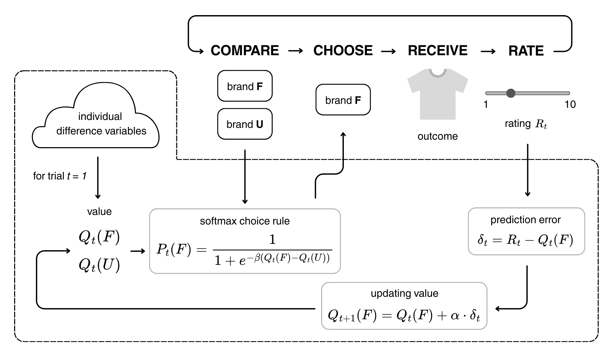

# Climate-RL

## Quick links
- R simulation [html of R markdown](https://html-preview.github.io/?url=https://github.com/gilleslijnzaad/climate-RL-modeling/blob/main/R_simulation/sim.html)
- Stan models + fits [html of R markdown](https://html-preview.github.io/?url=https://github.com/gilleslijnzaad/climate-RL-modeling/blob/main/stan_models/my_modeling/climate-RL.html)

## The paradigm
